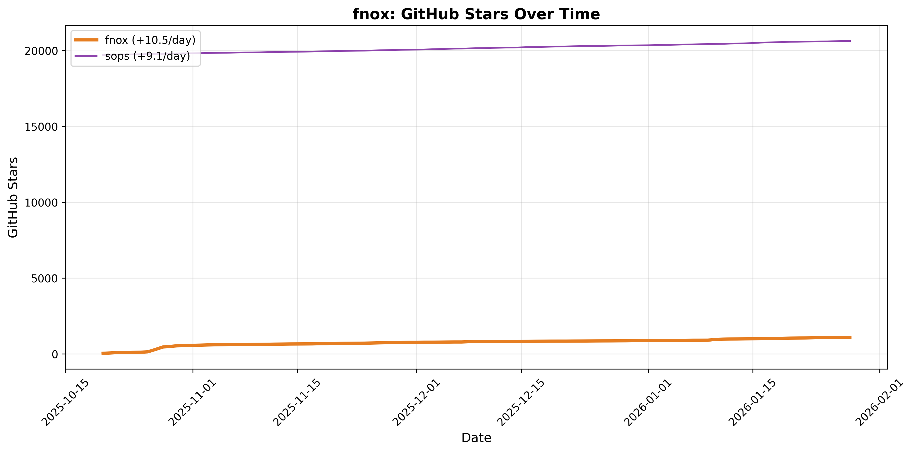

# mise Analytics

## Upcoming Crossovers

<!-- START upcoming-crossovers -->

| Competitor | Expected Crossover | Days Until | mise lead gain (stars/day) |
| --- | --- | --- | --- |
| asdf | 2026-03-07 | 33 | 30.1 |
| just | 2027-06-20 | 503 | 14.6 |

<!-- END upcoming-crossovers -->

## mise Stats

## fnox Stats

## hk Stats

## Top Repos Stats

## Homebrew Rankings

## mise Homebrew Ranking

## Fastest Growing jdx Repos (30 Days)

<!-- START fastest-growing -->

Data window: 2026-01-03 → 2026-02-01 (UTC)

| Date | mise | fnox | pitchfork | hk | usage |
| --- | --- | --- | --- | --- | --- |
| 2026-01-03 | 22,670 (+0) | 877 (+0) | 112 (+0) | 563 (+0) | 469 (+0) |
| 2026-01-04 | 22,688 (+18) | 881 (+4) | 112 (+0) | 565 (+2) | 468 (-1) |
| 2026-01-05 | 22,714 (+26) | 890 (+9) | 112 (+0) | 566 (+1) | 468 (+0) |
| 2026-01-06 | 22,757 (+43) | 893 (+3) | 112 (+0) | 566 (+0) | 468 (+0) |
| 2026-01-07 | 22,786 (+29) | 898 (+5) | 115 (+3) | 565 (-1) | 467 (-1) |
| 2026-01-08 | 22,815 (+29) | 901 (+3) | 115 (+0) | 567 (+2) | 467 (+0) |
| 2026-01-09 | 22,841 (+26) | 902 (+1) | 115 (+0) | 568 (+1) | 468 (+1) |
| 2026-01-10 | 22,872 (+31) | 905 (+3) | 115 (+0) | 568 (+0) | 468 (+0) |
| 2026-01-11 | 22,907 (+35) | 966 (+61) | 117 (+2) | 571 (+3) | 469 (+1) |
| 2026-01-12 | 22,939 (+32) | 973 (+7) | 117 (+0) | 572 (+1) | 470 (+1) |
| 2026-01-13 | 22,962 (+23) | 985 (+12) | 117 (+0) | 574 (+2) | 471 (+1) |
| 2026-01-14 | 22,994 (+32) | 986 (+1) | 119 (+2) | 578 (+4) | 472 (+1) |
| 2026-01-15 | 23,030 (+36) | 992 (+6) | 120 (+1) | 578 (+0) | 473 (+1) |
| 2026-01-16 | 23,072 (+42) | 996 (+4) | 120 (+0) | 579 (+1) | 473 (+0) |
| 2026-01-17 | 23,100 (+28) | 1,002 (+6) | 120 (+0) | 580 (+1) | 473 (+0) |
| 2026-01-18 | 23,134 (+34) | 1,010 (+8) | 124 (+4) | 582 (+2) | 475 (+2) |
| 2026-01-19 | 23,175 (+41) | 1,020 (+10) | 127 (+3) | 583 (+1) | 475 (+0) |
| 2026-01-20 | 23,205 (+30) | 1,029 (+9) | 130 (+3) | 583 (+0) | 476 (+1) |
| 2026-01-21 | 23,248 (+43) | 1,038 (+9) | 138 (+8) | 584 (+1) | 478 (+2) |
| 2026-01-22 | 23,280 (+32) | 1,044 (+6) | 153 (+15) | 587 (+3) | 479 (+1) |
| 2026-01-23 | 23,303 (+23) | 1,049 (+5) | 157 (+4) | 591 (+4) | 480 (+1) |
| 2026-01-24 | 23,445 (+142) | 1,066 (+17) | 158 (+1) | 592 (+1) | 485 (+5) |
| 2026-01-25 | 23,555 (+110) | 1,076 (+10) | 161 (+3) | 595 (+3) | 486 (+1) |
| 2026-01-26 | 23,631 (+76) | 1,080 (+4) | 163 (+2) | 596 (+1) | 486 (+0) |
| 2026-01-27 | 23,710 (+79) | 1,084 (+4) | 163 (+0) | 596 (+0) | 487 (+1) |
| 2026-01-28 | 23,780 (+70) | 1,088 (+4) | 165 (+2) | 599 (+3) | 490 (+3) |
| 2026-01-29 | 23,844 (+64) | 1,092 (+4) | 165 (+0) | 599 (+0) | 490 (+0) |
| 2026-01-30 | 23,890 (+46) | 1,099 (+7) | 167 (+2) | 600 (+1) | 492 (+2) |
| 2026-01-31 | 23,925 (+35) | 1,106 (+7) | 167 (+0) | 600 (+0) | 494 (+2) |
| 2026-02-01 | 24,010 (+85) | 1,108 (+2) | 169 (+2) | 606 (+6) | 498 (+4) |

- `mise` grew by +1,340 stars
- `fnox` grew by +231 stars
- `pitchfork` grew by +57 stars
- `hk` grew by +43 stars
- `usage` grew by +29 stars

<!-- END fastest-growing -->
