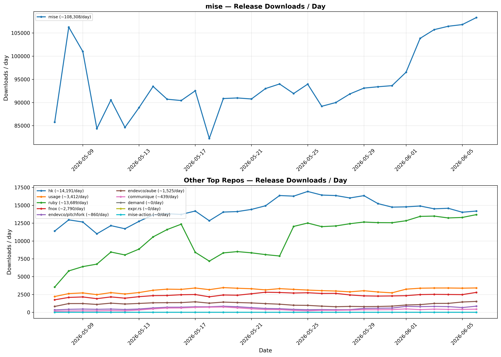

# mise Analytics

## Upcoming Crossovers

<!-- START upcoming-crossovers -->

| Project | Competitor | Expected Crossover | Days Until | lead gain (stars/day) |
| --- | --- | --- | --- | --- |
| mise | just | 2027-06-13 | 378 | 15.1 |
| aube | berry | 2028-08-24 | 816 | 12.4 |
| aube | npm | 2030-10-27 | 1611 | 10.4 |
| aube | yarn | 2032-10-07 | 2321 | 17.4 |

<!-- END upcoming-crossovers -->

## mise Stats

## fnox Stats

## hk Stats

## aube Stats

## Top Repos Stats

## Top Repos Downloads

## Homebrew Rankings

## mise Homebrew Ranking

## Fastest Growing jdx Repos (30 Days)

<!-- START fastest-growing -->

Data window: 2026-05-01 → 2026-05-30 (UTC)

| Date | mise | endevco/aube | fnox | hk | endevco/pitchfork |
| --- | --- | --- | --- | --- | --- |
| 2026-05-01 | 27,510 | 739 | 1,576 | 803 | 350 |
| 2026-05-02 | 27,550 (+40) | 760 (+21) | 1,583 (+7) | 805 (+2) | 355 (+5) |
| 2026-05-03 | 27,582 (+32) | 776 (+16) | 1,592 (+9) | 805 (+0) | 356 (+1) |
| 2026-05-04 | 27,619 (+37) | 790 (+14) | 1,597 (+5) | 807 (+2) | 358 (+2) |
| 2026-05-05 | 27,672 (+53) | 820 (+30) | 1,601 (+4) | 814 (+7) | 362 (+4) |
| 2026-05-06 | 27,728 (+56) | 853 (+33) | 1,605 (+4) | 816 (+2) | 366 (+4) |
| 2026-05-07 | 27,840 (+112) | 889 (+36) | 1,622 (+17) | 824 (+8) | 375 (+9) |
| 2026-05-08 | 27,914 (+74) | 927 (+38) | 1,629 (+7) | 831 (+7) | 379 (+4) |
| 2026-05-09 | 27,961 (+47) | 937 (+10) | 1,635 (+6) | 833 (+2) | 381 (+2) |
| 2026-05-10 | 27,991 (+30) | 949 (+12) | 1,641 (+6) | 836 (+3) | 383 (+2) |
| 2026-05-11 | 28,028 (+37) | 964 (+15) | 1,648 (+7) | 838 (+2) | 387 (+4) |
| 2026-05-12 | 28,069 (+41) | 1,008 (+44) | 1,653 (+5) | 839 (+1) | 387 (+0) |
| 2026-05-13 | 28,113 (+44) | 1,032 (+24) | 1,660 (+7) | 843 (+4) | 388 (+1) |
| 2026-05-14 | 28,172 (+59) | 1,057 (+25) | 1,669 (+9) | 848 (+5) | 390 (+2) |
| 2026-05-15 | 28,210 (+38) | 1,072 (+15) | 1,675 (+6) | 850 (+2) | 390 (+0) |
| 2026-05-16 | 28,247 (+37) | 1,089 (+17) | 1,677 (+2) | 853 (+3) | 390 (+0) |
| 2026-05-17 | 28,273 (+26) | 1,098 (+9) | 1,681 (+4) | 854 (+1) | 391 (+1) |
| 2026-05-18 | 28,304 (+31) | 1,108 (+10) | 1,686 (+5) | 856 (+2) | 393 (+2) |
| 2026-05-19 | 28,358 (+54) | 1,119 (+11) | 1,690 (+4) | 861 (+5) | 395 (+2) |
| 2026-05-20 | 28,406 (+48) | 1,152 (+33) | 1,695 (+5) | 863 (+2) | 396 (+1) |
| 2026-05-21 | 28,434 (+28) | 1,166 (+14) | 1,702 (+7) | 865 (+2) | 396 (+0) |
| 2026-05-22 | 28,485 (+51) | 1,173 (+7) | 1,706 (+4) | 867 (+2) | 397 (+1) |
| 2026-05-23 | 28,519 (+34) | 1,178 (+5) | 1,707 (+1) | 868 (+1) | 397 (+0) |
| 2026-05-24 | 28,543 (+24) | 1,191 (+13) | 1,712 (+5) | 869 (+1) | 401 (+4) |
| 2026-05-25 | 28,604 (+61) | 1,199 (+8) | 1,716 (+4) | 871 (+2) | 403 (+2) |
| 2026-05-26 | 28,643 (+39) | 1,205 (+6) | 1,719 (+3) | 872 (+1) | 407 (+4) |
| 2026-05-27 | 28,683 (+40) | 1,209 (+4) | 1,723 (+4) | 874 (+2) | 408 (+1) |
| 2026-05-28 | 28,729 (+46) | 1,217 (+8) | 1,728 (+5) | 878 (+4) | 409 (+1) |
| 2026-05-29 | 28,782 (+53) | 1,225 (+8) | 1,730 (+2) | 880 (+2) | 411 (+2) |
| 2026-05-30 | 28,820 (+38) | 1,233 (+8) | 1,731 (+1) | 881 (+1) | 414 (+3) |

- `mise` grew by +1,310 stars
- `endevco/aube` grew by +494 stars
- `fnox` grew by +155 stars
- `hk` grew by +78 stars
- `endevco/pitchfork` grew by +64 stars

<!-- END fastest-growing -->
