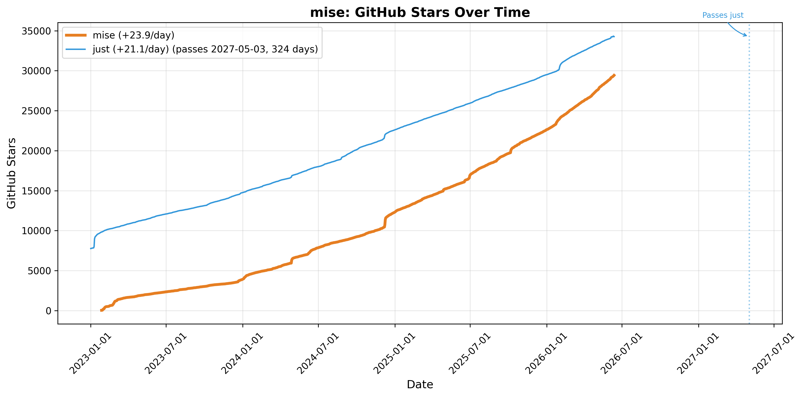
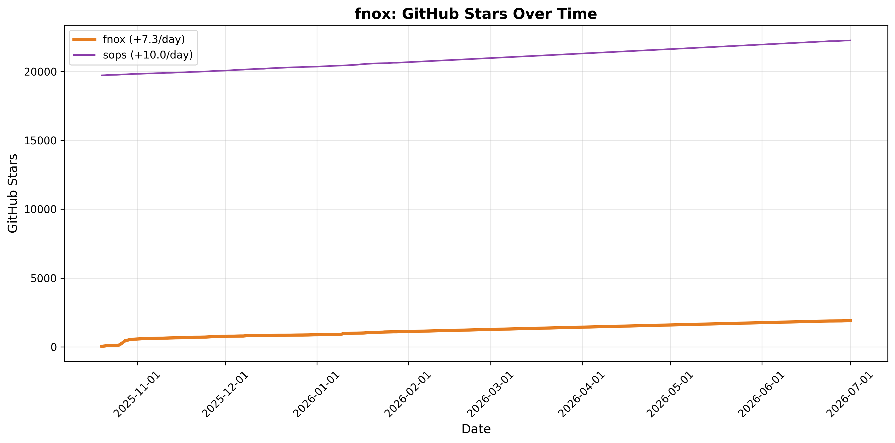
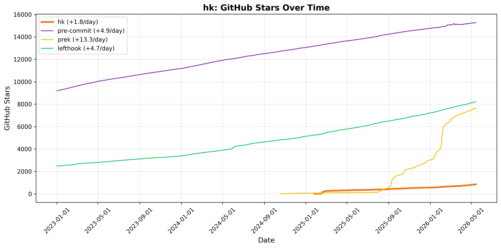
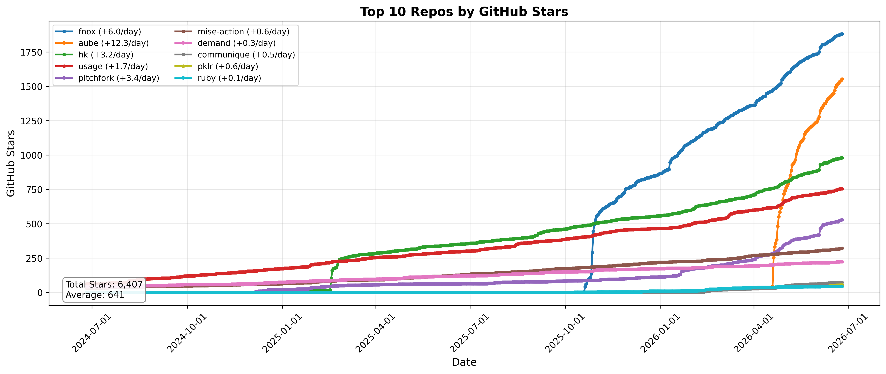
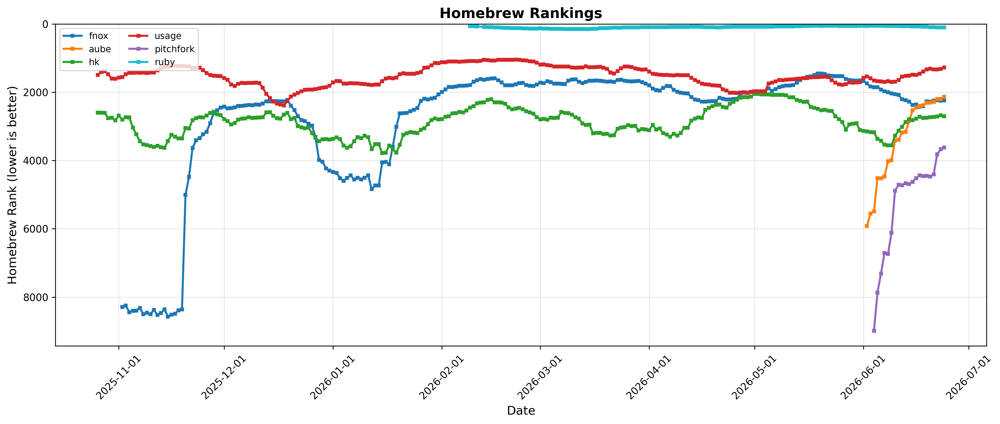
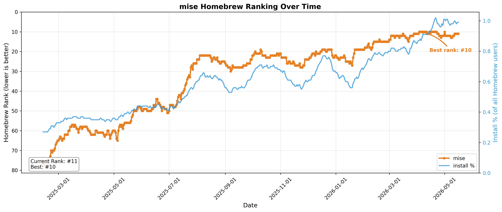

# mise Analytics

## Upcoming Crossovers

<!-- START upcoming-crossovers -->

| Competitor | Expected Crossover | Days Until | mise lead gain (stars/day) |
| --- | --- | --- | --- |
| just | 2028-08-13 | 874 | 8.1 |

<!-- END upcoming-crossovers -->

## mise Stats

## fnox Stats

## hk Stats

## Top Repos Stats

## Homebrew Rankings

## mise Homebrew Ranking

## Fastest Growing jdx Repos (30 Days)

<!-- START fastest-growing -->

Data window: 2026-02-21 → 2026-03-22 (UTC)

| Date | mise | fnox | usage | hk | pitchfork |
| --- | --- | --- | --- | --- | --- |
| 2026-02-21 | 24,811 (+0) | 1,197 (+0) | 527 (+0) | 651 (+0) | 193 (+0) |
| 2026-02-22 | 24,843 (+32) | 1,199 (+2) | 527 (+0) | 652 (+1) | 193 (+0) |
| 2026-02-23 | 24,891 (+48) | 1,205 (+6) | 528 (+1) | 652 (+0) | 194 (+1) |
| 2026-02-24 | 24,949 (+58) | 1,213 (+8) | 531 (+3) | 654 (+2) | 194 (+0) |
| 2026-02-25 | 24,996 (+47) | 1,224 (+11) | 534 (+3) | 656 (+2) | 195 (+1) |
| 2026-02-26 | 25,045 (+49) | 1,233 (+9) | 536 (+2) | 660 (+4) | 197 (+2) |
| 2026-02-27 | 25,076 (+31) | 1,237 (+4) | 537 (+1) | 663 (+3) | 197 (+0) |
| 2026-02-28 | 25,106 (+30) | 1,241 (+4) | 536 (-1) | 664 (+1) | 199 (+2) |
| 2026-03-01 | 25,125 (+19) | 1,243 (+2) | 536 (+0) | 664 (+0) | 199 (+0) |
| 2026-03-02 | 25,159 (+34) | 1,243 (+0) | 537 (+1) | 665 (+1) | 199 (+0) |
| 2026-03-03 | 25,192 (+33) | 1,246 (+3) | 538 (+1) | 665 (+0) | 200 (+1) |
| 2026-03-04 | 25,232 (+40) | 1,258 (+12) | 539 (+1) | 665 (+0) | 200 (+0) |
| 2026-03-05 | 25,279 (+47) | 1,266 (+8) | 540 (+1) | 667 (+2) | 202 (+2) |
| 2026-03-06 | 25,307 (+28) | 1,272 (+6) | 542 (+2) | 669 (+2) | 206 (+4) |
| 2026-03-07 | 25,345 (+38) | 1,275 (+3) | 548 (+6) | 669 (+0) | 207 (+1) |
| 2026-03-08 | 25,379 (+34) | 1,276 (+1) | 553 (+5) | 671 (+2) | 207 (+0) |
| 2026-03-09 | 25,433 (+54) | 1,282 (+6) | 562 (+9) | 676 (+5) | 209 (+2) |
| 2026-03-10 | 25,471 (+38) | 1,287 (+5) | 573 (+11) | 676 (+0) | 210 (+1) |
| 2026-03-11 | 25,499 (+28) | 1,292 (+5) | 573 (+0) | 676 (+0) | 211 (+1) |
| 2026-03-12 | 25,542 (+43) | 1,294 (+2) | 575 (+2) | 681 (+5) | 212 (+1) |
| 2026-03-13 | 25,584 (+42) | 1,302 (+8) | 579 (+4) | 683 (+2) | 217 (+5) |
| 2026-03-14 | 25,612 (+28) | 1,308 (+6) | 582 (+3) | 684 (+1) | 217 (+0) |
| 2026-03-15 | 25,648 (+36) | 1,310 (+2) | 582 (+0) | 686 (+2) | 217 (+0) |
| 2026-03-16 | 25,679 (+31) | 1,316 (+6) | 585 (+3) | 687 (+1) | 218 (+1) |
| 2026-03-17 | 25,718 (+39) | 1,321 (+5) | 587 (+2) | 688 (+1) | 220 (+2) |
| 2026-03-18 | 25,758 (+40) | 1,324 (+3) | 587 (+0) | 688 (+0) | 223 (+3) |
| 2026-03-19 | 25,810 (+52) | 1,327 (+3) | 587 (+0) | 689 (+1) | 224 (+1) |
| 2026-03-20 | 25,848 (+38) | 1,329 (+2) | 587 (+0) | 690 (+1) | 224 (+0) |
| 2026-03-21 | 25,884 (+36) | 1,330 (+1) | 587 (+0) | 691 (+1) | 225 (+1) |
| 2026-03-22 | 25,918 (+34) | 1,335 (+5) | 587 (+0) | 691 (+0) | 225 (+0) |

- `mise` grew by +1,107 stars
- `fnox` grew by +138 stars
- `usage` grew by +60 stars
- `hk` grew by +40 stars
- `pitchfork` grew by +32 stars

<!-- END fastest-growing -->
