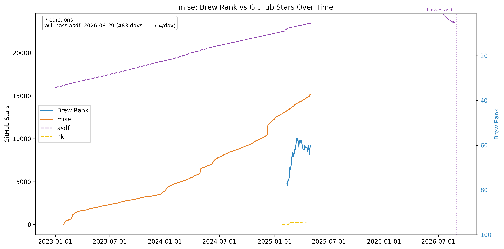

# mise Analytics

This repository tracks analytics for [mise](https://github.com/jdx/mise), including:
- Homebrew installation statistics
- GitHub star history
- Comparison with similar tools (nix and asdf)

## Current Stats

The graph shows:
- Homebrew rank (lower is better)
- GitHub star count over time for mise, nix, and asdf

## Data Collection
Stats are collected daily via GitHub Actions and include:
- Homebrew analytics from formulae.brew.sh
- GitHub star counts for mise and competitors
