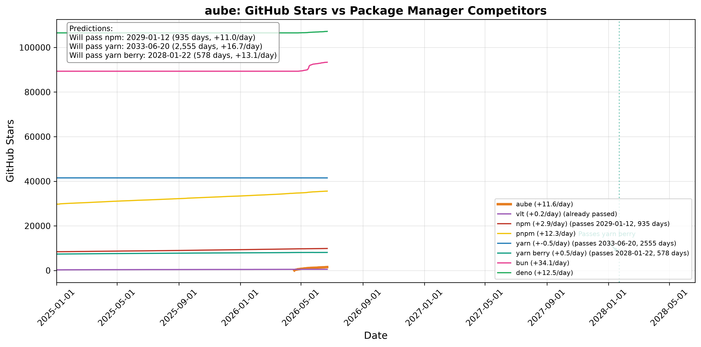

# mise Analytics

## Upcoming Crossovers

<!-- START upcoming-crossovers -->

| Competitor | Expected Crossover | Days Until | mise lead gain (stars/day) |
| --- | --- | --- | --- |
| just | 2028-01-06 | 615 | 10.5 |

<!-- END upcoming-crossovers -->

## mise Stats

## fnox Stats

## hk Stats

## aube Stats

## Top Repos Stats

## Homebrew Rankings

## mise Homebrew Ranking

## Fastest Growing jdx Repos (30 Days)

<!-- START fastest-growing -->

Data window: 2026-04-02 → 2026-05-01 (UTC)

| Date | mise | endevco/aube | fnox | hk | pitchfork |
| --- | --- | --- | --- | --- | --- |
| 2026-04-02 | 26,292 | — | 1,363 | 711 | 238 |
| 2026-04-03 | 26,337 (+45) | — | 1,382 (+19) | 722 (+11) | 251 (+13) |
| 2026-04-04 | 26,358 (+21) | — | 1,394 (+12) | 727 (+5) | 258 (+7) |
| 2026-04-05 | 26,373 (+15) | — | 1,398 (+4) | 730 (+3) | 259 (+1) |
| 2026-04-06 | 26,395 (+22) | — | 1,403 (+5) | 732 (+2) | 262 (+3) |
| 2026-04-07 | 26,434 (+39) | — | 1,408 (+5) | 735 (+3) | 262 (+0) |
| 2026-04-08 | 26,486 (+52) | — | 1,414 (+6) | 735 (+0) | 265 (+3) |
| 2026-04-09 | 26,523 (+37) | — | 1,417 (+3) | 737 (+2) | 266 (+1) |
| 2026-04-10 | 26,562 (+39) | — | 1,424 (+7) | 743 (+6) | 269 (+3) |
| 2026-04-11 | 26,587 (+25) | — | 1,427 (+3) | 745 (+2) | 269 (+0) |
| 2026-04-12 | 26,614 (+27) | — | 1,429 (+2) | 749 (+4) | 270 (+1) |
| 2026-04-13 | 26,648 (+34) | — | 1,445 (+16) | 749 (+0) | 271 (+1) |
| 2026-04-14 | 26,683 (+35) | — | 1,451 (+6) | 750 (+1) | 272 (+1) |
| 2026-04-15 | 26,719 (+36) | — | 1,455 (+4) | 751 (+1) | 272 (+0) |
| 2026-04-16 | 26,762 (+43) | — | 1,458 (+3) | 753 (+2) | 275 (+3) |
| 2026-04-17 | 26,805 (+43) | — | 1,462 (+4) | 753 (+0) | 277 (+2) |
| 2026-04-18 | 26,828 (+23) | — | 1,465 (+3) | 756 (+3) | 280 (+3) |
| 2026-04-19 | 26,868 (+40) | 44 | 1,467 (+2) | 757 (+1) | 281 (+1) |
| 2026-04-20 | 26,954 (+86) | 252 (+208) | 1,476 (+9) | 758 (+1) | 287 (+6) |
| 2026-04-21 | 26,997 (+43) | 332 (+80) | 1,482 (+6) | 762 (+4) | 290 (+3) |
| 2026-04-22 | 27,050 (+53) | 357 (+25) | 1,486 (+4) | 764 (+2) | 294 (+4) |
| 2026-04-23 | 27,097 (+47) | 382 (+25) | 1,492 (+6) | 765 (+1) | 297 (+3) |
| 2026-04-24 | 27,153 (+56) | 481 (+99) | 1,503 (+11) | 768 (+3) | 304 (+7) |
| 2026-04-25 | 27,203 (+50) | 550 (+69) | 1,509 (+6) | 774 (+6) | 308 (+4) |
| 2026-04-26 | 27,259 (+56) | 583 (+33) | 1,512 (+3) | 782 (+8) | 317 (+9) |
| 2026-04-27 | 27,301 (+42) | 613 (+30) | 1,522 (+10) | 786 (+4) | 317 (+0) |
| 2026-04-28 | 27,363 (+62) | 639 (+26) | 1,547 (+25) | 789 (+3) | 317 (+0) |
| 2026-04-29 | 27,406 (+43) | 672 (+33) | 1,559 (+12) | 793 (+4) | 317 (+0) |
| 2026-04-30 | 27,465 (+59) | 716 (+44) | 1,565 (+6) | 797 (+4) | 317 (+0) |
| 2026-05-01 | 27,510 (+45) | 739 (+23) | 1,576 (+11) | 803 (+6) | 317 (+0) |

- `mise` grew by +1,218 stars
- `endevco/aube` grew by +695 stars
- `fnox` grew by +213 stars
- `hk` grew by +92 stars
- `pitchfork` grew by +79 stars

<!-- END fastest-growing -->
