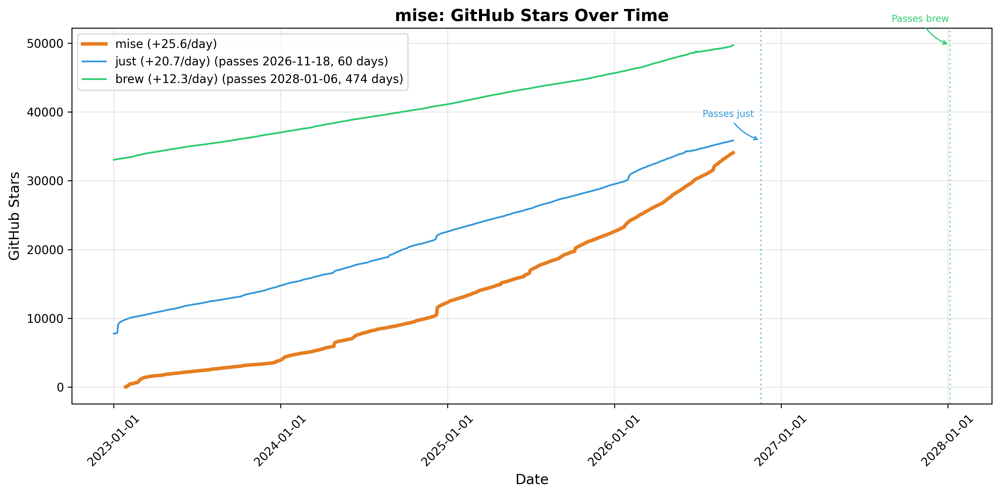
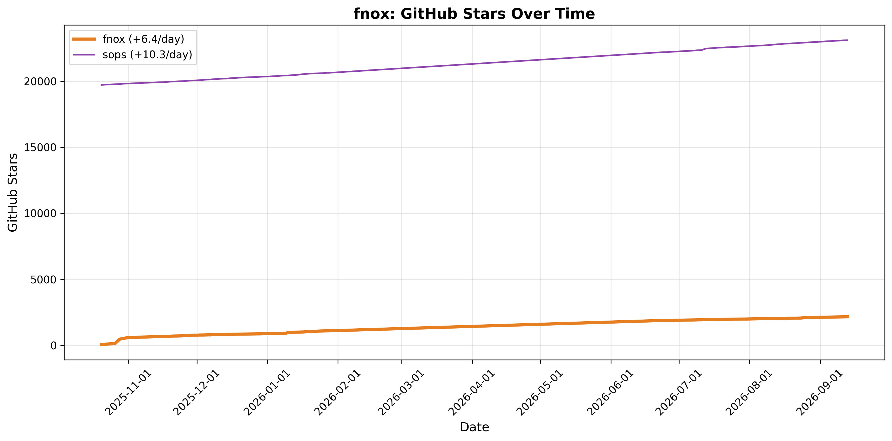
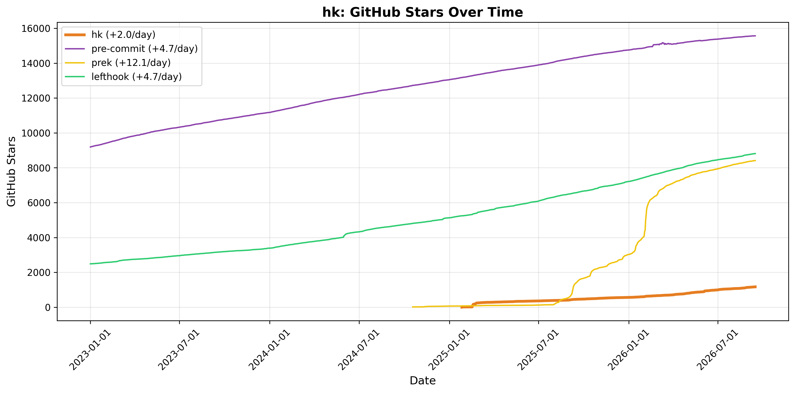
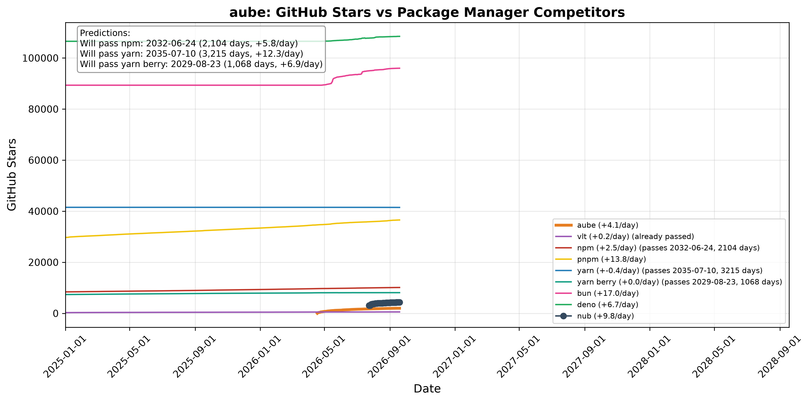
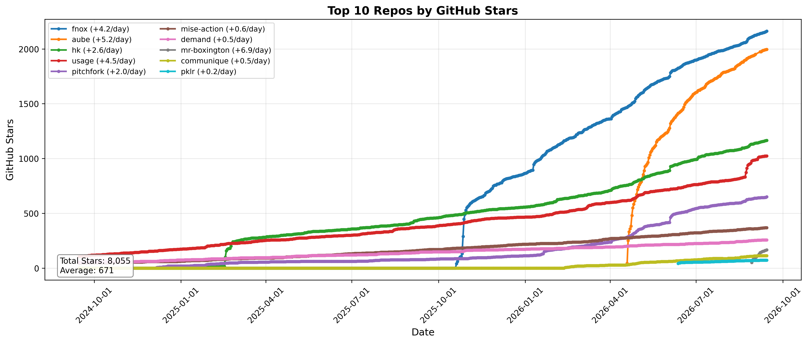
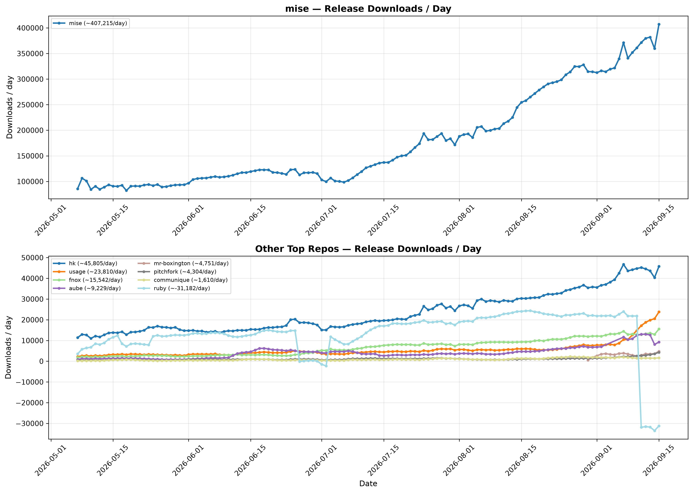
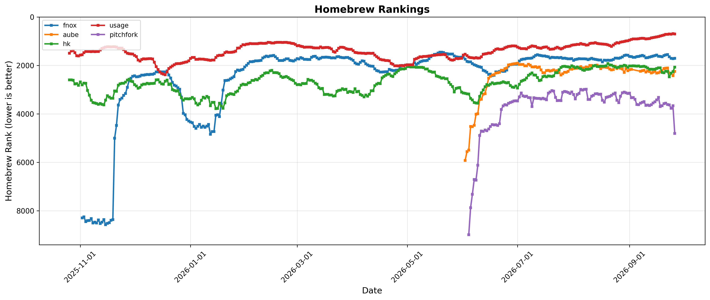
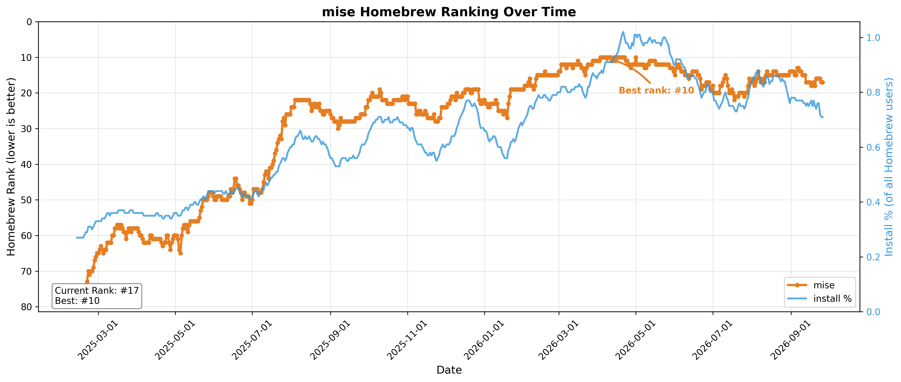

# mise Analytics

## Upcoming Crossovers

<!-- START upcoming-crossovers -->

| Project | Competitor | Expected Crossover | Days Until | lead gain (stars/day) |
| --- | --- | --- | --- | --- |
| mise | just | 2027-02-13 | 205 | 19.4 |
| aube | berry | 2028-06-08 | 685 | 10.0 |
| mise | brew | 2028-06-19 | 696 | 25.7 |
| aube | npm | 2030-07-25 | 1462 | 7.3 |
| aube | yarn | 2035-03-18 | 3159 | 12.6 |

<!-- END upcoming-crossovers -->

## mise Stats

## fnox Stats

## hk Stats

## aube Stats

## Top Repos Stats

## Top Repos Downloads

## Homebrew Rankings

## mise Homebrew Ranking

## Fastest Growing jdx Repos (30 Days)

<!-- START fastest-growing -->

Data window: 2026-06-24 → 2026-07-23 (UTC)

| Date | mise | aube | fnox | hk | pitchfork |
| --- | --- | --- | --- | --- | --- |
| 2026-06-24 | 29,973 | 1,541 | 1,879 | 978 | 526 |
| 2026-06-25 | 30,072 (+99) | 1,552 (+11) | 1,881 (+2) | 980 (+2) | 529 (+3) |
| 2026-06-26 | 30,144 (+72) | 1,563 (+11) | 1,885 (+4) | 984 (+4) | 532 (+3) |
| 2026-06-27 | 30,175 (+31) | 1,574 (+11) | 1,887 (+2) | 985 (+1) | 536 (+4) |
| 2026-06-28 | 30,203 (+28) | 1,586 (+12) | 1,888 (+1) | 988 (+3) | 537 (+1) |
| 2026-06-29 | 30,241 (+38) | 1,591 (+5) | 1,895 (+7) | 990 (+2) | 539 (+2) |
| 2026-06-30 | 30,286 (+45) | 1,599 (+8) | 1,899 (+4) | 991 (+1) | 542 (+3) |
| 2026-07-01 | 30,313 (+27) | 1,604 (+5) | 1,899 (+0) | 991 (+0) | 544 (+2) |
| 2026-07-02 | 30,343 (+30) | 1,608 (+4) | 1,902 (+3) | 994 (+3) | 546 (+2) |
| 2026-07-03 | 30,375 (+32) | 1,619 (+11) | 1,905 (+3) | 1,006 (+12) | 548 (+2) |
| 2026-07-04 | 30,406 (+31) | 1,623 (+4) | 1,911 (+6) | 1,014 (+8) | 552 (+4) |
| 2026-07-05 | 30,432 (+26) | 1,624 (+1) | 1,913 (+2) | 1,015 (+1) | 553 (+1) |
| 2026-07-06 | 30,460 (+28) | 1,633 (+9) | 1,914 (+1) | 1,018 (+3) | 554 (+1) |
| 2026-07-07 | 30,498 (+38) | 1,635 (+2) | 1,918 (+4) | 1,021 (+3) | 554 (+0) |
| 2026-07-08 | 30,532 (+34) | 1,641 (+6) | 1,920 (+2) | 1,023 (+2) | 554 (+0) |
| 2026-07-09 | 30,564 (+32) | 1,645 (+4) | 1,925 (+5) | 1,024 (+1) | 555 (+1) |
| 2026-07-10 | 30,598 (+34) | 1,650 (+5) | 1,927 (+2) | 1,026 (+2) | 558 (+3) |
| 2026-07-11 | 30,633 (+35) | 1,662 (+12) | 1,931 (+4) | 1,033 (+7) | 558 (+0) |
| 2026-07-12 | 30,656 (+23) | 1,679 (+17) | 1,936 (+5) | 1,036 (+3) | 559 (+1) |
| 2026-07-13 | 30,691 (+35) | 1,685 (+6) | 1,938 (+2) | 1,036 (+0) | 559 (+0) |
| 2026-07-14 | 30,741 (+50) | 1,693 (+8) | 1,947 (+9) | 1,036 (+0) | 560 (+1) |
| 2026-07-15 | 30,782 (+41) | 1,700 (+7) | 1,950 (+3) | 1,037 (+1) | 562 (+2) |
| 2026-07-16 | 30,824 (+42) | 1,704 (+4) | 1,951 (+1) | 1,039 (+2) | 565 (+3) |
| 2026-07-17 | 30,861 (+37) | 1,708 (+4) | 1,954 (+3) | 1,041 (+2) | 567 (+2) |
| 2026-07-18 | 30,873 (+12) | 1,711 (+3) | 1,958 (+4) | 1,041 (+0) | 569 (+2) |
| 2026-07-19 | 30,885 (+12) | 1,715 (+4) | 1,961 (+3) | 1,042 (+1) | 570 (+1) |
| 2026-07-20 | 30,917 (+32) | 1,722 (+7) | 1,963 (+2) | 1,043 (+1) | 571 (+1) |
| 2026-07-21 | 30,957 (+40) | 1,729 (+7) | 1,968 (+5) | 1,046 (+3) | 573 (+2) |
| 2026-07-22 | 30,996 (+39) | 1,732 (+3) | 1,970 (+2) | 1,046 (+0) | 573 (+0) |
| 2026-07-23 | 31,026 (+30) | 1,735 (+3) | 1,975 (+5) | 1,046 (+0) | 575 (+2) |

- `mise` grew by +1,053 stars
- `aube` grew by +194 stars
- `fnox` grew by +96 stars
- `hk` grew by +68 stars
- `pitchfork` grew by +49 stars

<!-- END fastest-growing -->
