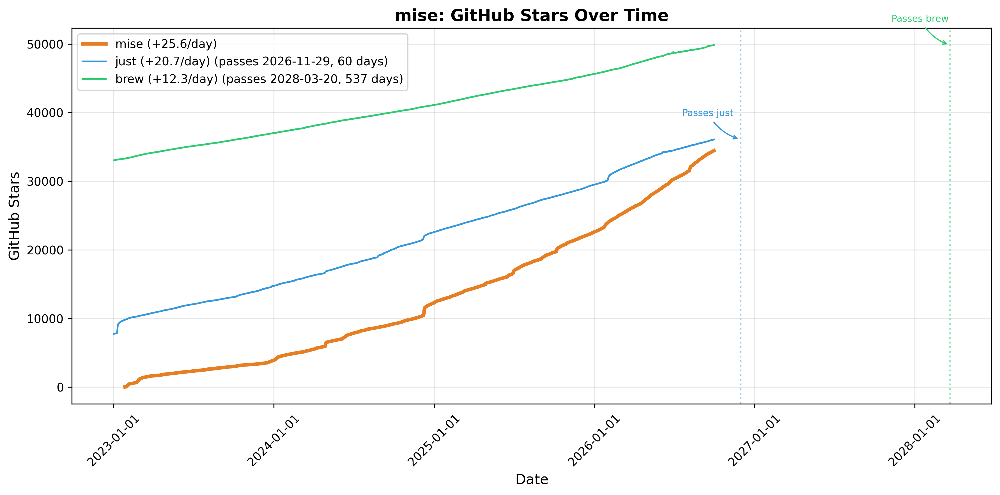
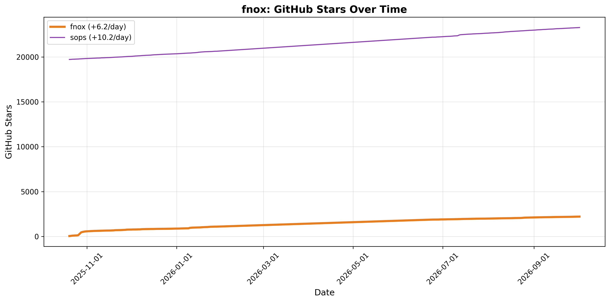
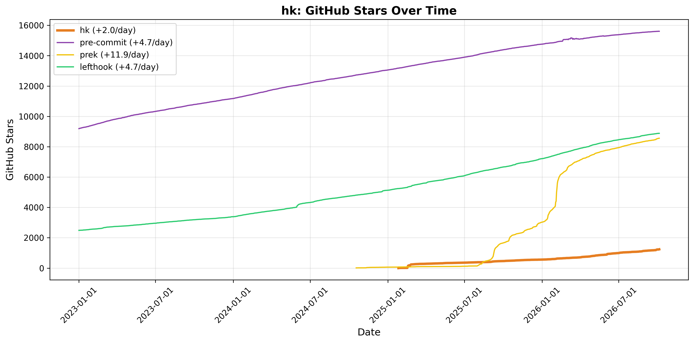
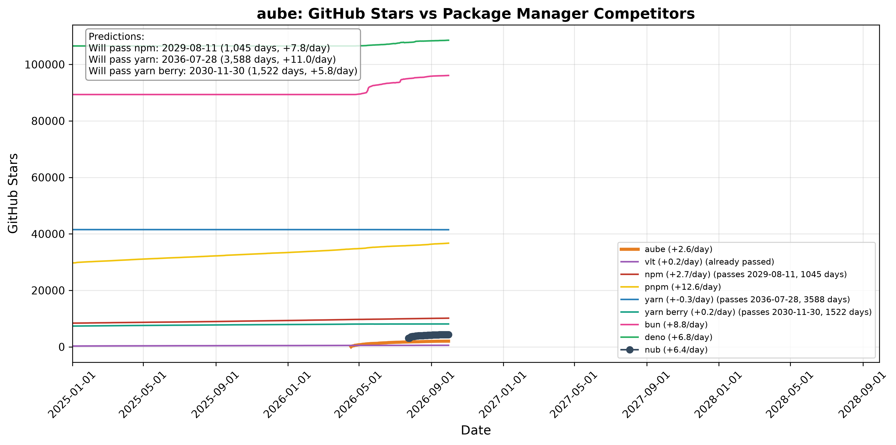
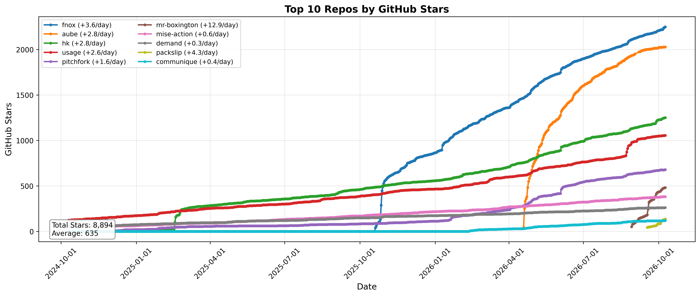
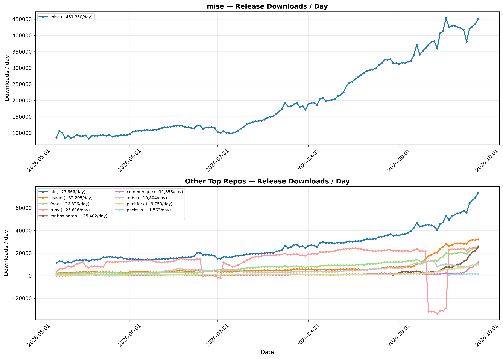
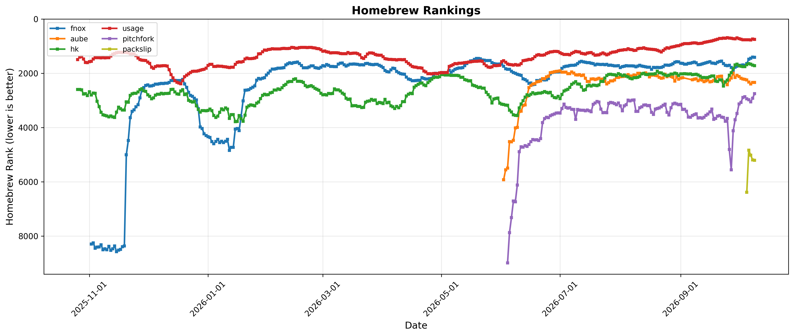
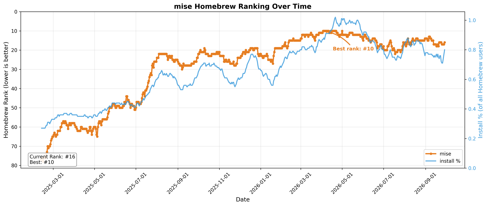

# mise Analytics

## Upcoming Crossovers

<!-- START upcoming-crossovers -->

| Project | Competitor | Expected Crossover | Days Until | lead gain (stars/day) |
| --- | --- | --- | --- | --- |
| mise | just | 2026-12-05 | 59 | 26.4 |
| mise | brew | 2028-04-18 | 559 | 29.4 |
| aube | berry | 2029-08-04 | 1032 | 6.9 |
| aube | npm | 2030-01-01 | 1182 | 6.9 |

<!-- END upcoming-crossovers -->

## mise Stats

## fnox Stats

## hk Stats

## aube Stats

## Top Repos Stats

## Top Repos Downloads

## Homebrew Rankings

## mise Homebrew Ranking

## Fastest Growing jdx Repos (30 Days)

<!-- START fastest-growing -->

Data window: 2026-09-07 → 2026-10-06 (UTC)

| Date | mise | mr-boxington | hk | fnox | packslip |
| --- | --- | --- | --- | --- | --- |
| 2026-09-07 | 33,566 | 141 | 1,149 | 2,141 | — |
| 2026-09-08 | 33,629 (+63) | 145 (+4) | 1,153 (+4) | 2,144 (+3) | — |
| 2026-09-09 | 33,687 (+58) | 151 (+6) | 1,155 (+2) | 2,146 (+2) | — |
| 2026-09-10 | 33,731 (+44) | 153 (+2) | 1,156 (+1) | 2,148 (+2) | — |
| 2026-09-11 | 33,783 (+52) | 155 (+2) | 1,159 (+3) | 2,151 (+3) | — |
| 2026-09-12 | 33,821 (+38) | 161 (+6) | 1,161 (+2) | 2,154 (+3) | — |
| 2026-09-13 | 33,844 (+23) | 162 (+1) | 1,164 (+3) | 2,158 (+4) | — |
| 2026-09-14 | 33,892 (+48) | 167 (+5) | 1,165 (+1) | 2,163 (+5) | — |
| 2026-09-15 | 33,945 (+53) | 172 (+5) | 1,167 (+2) | 2,165 (+2) | — |
| 2026-09-16 | 33,970 (+25) | 174 (+2) | 1,168 (+1) | 2,167 (+2) | — |
| 2026-09-17 | 34,013 (+43) | 182 (+8) | 1,170 (+2) | 2,170 (+3) | 43 |
| 2026-09-18 | 34,059 (+46) | 244 (+62) | 1,171 (+1) | 2,172 (+2) | 45 (+2) |
| 2026-09-19 | 34,083 (+24) | 318 (+74) | 1,172 (+1) | 2,173 (+1) | 49 (+4) |
| 2026-09-20 | 34,110 (+27) | 329 (+11) | 1,173 (+1) | 2,174 (+1) | 50 (+1) |
| 2026-09-21 | 34,153 (+43) | 336 (+7) | 1,174 (+1) | 2,176 (+2) | 51 (+1) |
| 2026-09-22 | 34,181 (+28) | 339 (+3) | 1,176 (+2) | 2,180 (+4) | 51 (+0) |
| 2026-09-23 | 34,216 (+35) | 346 (+7) | 1,180 (+4) | 2,180 (+0) | 54 (+3) |
| 2026-09-24 | 34,241 (+25) | 351 (+5) | 1,182 (+2) | 2,181 (+1) | 59 (+5) |
| 2026-09-25 | 34,272 (+31) | 354 (+3) | 1,184 (+2) | 2,187 (+6) | 59 (+0) |
| 2026-09-26 | 34,302 (+30) | 372 (+18) | 1,184 (+0) | 2,190 (+3) | 61 (+2) |
| 2026-09-27 | 34,329 (+27) | 386 (+14) | 1,186 (+2) | 2,191 (+1) | 61 (+0) |
| 2026-09-28 | 34,361 (+32) | 413 (+27) | 1,207 (+21) | 2,194 (+3) | 63 (+2) |
| 2026-09-29 | 34,413 (+52) | 424 (+11) | 1,218 (+11) | 2,202 (+8) | 74 (+11) |
| 2026-09-30 | 34,452 (+39) | 431 (+7) | 1,225 (+7) | 2,207 (+5) | 83 (+9) |
| 2026-10-01 | 34,478 (+26) | 435 (+4) | 1,227 (+2) | 2,210 (+3) | 84 (+1) |
| 2026-10-02 | 34,500 (+22) | 436 (+1) | 1,228 (+1) | 2,212 (+2) | 84 (+0) |
| 2026-10-03 | 34,540 (+40) | 440 (+4) | 1,228 (+0) | 2,216 (+4) | 85 (+1) |
| 2026-10-04 | 34,572 (+32) | 453 (+13) | 1,230 (+2) | 2,220 (+4) | 105 (+20) |
| 2026-10-05 | 34,595 (+23) | 463 (+10) | 1,238 (+8) | 2,219 (-1) | 118 (+13) |
| 2026-10-06 | 34,638 (+43) | 471 (+8) | 1,243 (+5) | 2,222 (+3) | 122 (+4) |

- `mise` grew by +1,072 stars
- `mr-boxington` grew by +330 stars
- `hk` grew by +94 stars
- `fnox` grew by +81 stars
- `packslip` grew by +79 stars

<!-- END fastest-growing -->
