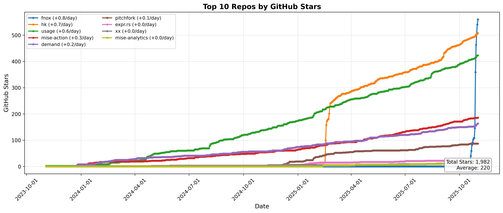

# mise Analytics

## Upcoming Crossovers

<!-- START upcoming-crossovers -->

| Competitor | Expected Crossover | Days Until | mise lead gain (stars/day) |
| --- | --- | --- | --- |
| asdf | 2026-04-02 | 72 | 24.1 |

<!-- END upcoming-crossovers -->

## mise Stats

## hk Stats

## Top Repos Stats

## Homebrew Rankings

## mise Homebrew Ranking

## Fastest Growing jdx Repos (30 Days)

<!-- START fastest-growing -->

Data window: 2025-12-22 → 2026-01-20 (UTC)

| Date | mise | fnox | hk | pitchfork | mise-action |
| --- | --- | --- | --- | --- | --- |
| 2025-12-22 | 22,322 (+0) | 844 (+0) | 555 (+0) | 109 (+0) | 215 (+0) |
| 2025-12-23 | 22,355 (+33) | 848 (+4) | 557 (+2) | 110 (+1) | 215 (+0) |
| 2025-12-24 | 22,398 (+43) | 849 (+1) | 557 (+0) | 110 (+0) | 215 (+0) |
| 2025-12-25 | 22,424 (+26) | 855 (+6) | 558 (+1) | 110 (+0) | 217 (+2) |
| 2025-12-26 | 22,448 (+24) | 855 (+0) | 558 (+0) | 110 (+0) | 217 (+0) |
| 2025-12-27 | 22,473 (+25) | 857 (+2) | 558 (+0) | 111 (+1) | 217 (+0) |
| 2025-12-28 | 22,491 (+18) | 859 (+2) | 559 (+1) | 111 (+0) | 217 (+0) |
| 2025-12-29 | 22,520 (+29) | 861 (+2) | 560 (+1) | 111 (+0) | 218 (+1) |
| 2025-12-30 | 22,560 (+40) | 865 (+4) | 560 (+0) | 112 (+1) | 218 (+0) |
| 2025-12-31 | 22,607 (+47) | 869 (+4) | 562 (+2) | 112 (+0) | 219 (+1) |
| 2026-01-01 | 22,630 (+23) | 874 (+5) | 562 (+0) | 112 (+0) | 219 (+0) |
| 2026-01-02 | 22,649 (+19) | 874 (+0) | 562 (+0) | 112 (+0) | 219 (+0) |
| 2026-01-03 | 22,670 (+21) | 877 (+3) | 563 (+1) | 112 (+0) | 219 (+0) |
| 2026-01-04 | 22,688 (+18) | 881 (+4) | 565 (+2) | 112 (+0) | 219 (+0) |
| 2026-01-05 | 22,714 (+26) | 890 (+9) | 566 (+1) | 112 (+0) | 219 (+0) |
| 2026-01-06 | 22,757 (+43) | 893 (+3) | 566 (+0) | 112 (+0) | 220 (+1) |
| 2026-01-07 | 22,786 (+29) | 898 (+5) | 565 (-1) | 115 (+3) | 220 (+0) |
| 2026-01-08 | 22,815 (+29) | 901 (+3) | 567 (+2) | 115 (+0) | 220 (+0) |
| 2026-01-09 | 22,841 (+26) | 902 (+1) | 568 (+1) | 115 (+0) | 220 (+0) |
| 2026-01-10 | 22,872 (+31) | 905 (+3) | 568 (+0) | 115 (+0) | 221 (+1) |
| 2026-01-11 | 22,907 (+35) | 966 (+61) | 571 (+3) | 117 (+2) | 221 (+0) |
| 2026-01-12 | 22,939 (+32) | 973 (+7) | 572 (+1) | 117 (+0) | 221 (+0) |
| 2026-01-13 | 22,962 (+23) | 985 (+12) | 574 (+2) | 117 (+0) | 222 (+1) |
| 2026-01-14 | 22,994 (+32) | 986 (+1) | 578 (+4) | 119 (+2) | 224 (+2) |
| 2026-01-15 | 23,030 (+36) | 992 (+6) | 578 (+0) | 120 (+1) | 224 (+0) |
| 2026-01-16 | 23,072 (+42) | 996 (+4) | 579 (+1) | 120 (+0) | 224 (+0) |
| 2026-01-17 | 23,100 (+28) | 1,002 (+6) | 580 (+1) | 120 (+0) | 224 (+0) |
| 2026-01-18 | 23,134 (+34) | 1,010 (+8) | 582 (+2) | 124 (+4) | 225 (+1) |
| 2026-01-19 | 23,175 (+41) | 1,020 (+10) | 583 (+1) | 127 (+3) | 225 (+0) |
| 2026-01-20 | 23,205 (+30) | 1,029 (+9) | 583 (+0) | 130 (+3) | 226 (+1) |

- `mise` grew by +883 stars
- `fnox` grew by +185 stars
- `hk` grew by +28 stars
- `pitchfork` grew by +21 stars
- `mise-action` grew by +11 stars

<!-- END fastest-growing -->
