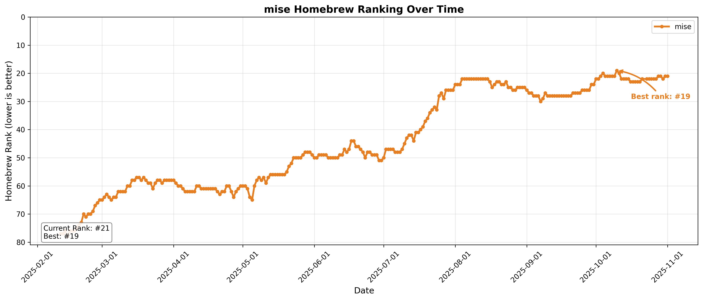

# mise Analytics

## Upcoming Crossovers

<!-- START upcoming-crossovers -->

| Competitor | Expected Crossover | Days Until | mise lead gain (stars/day) |
| --- | --- | --- | --- |
| asdf | 2026-03-02 | 15 | 35.7 |
| just | 2028-01-29 | 714 | 9.9 |

<!-- END upcoming-crossovers -->

## mise Stats

## fnox Stats

## hk Stats

## Top Repos Stats

## Homebrew Rankings

## mise Homebrew Ranking

## Fastest Growing jdx Repos (30 Days)

<!-- START fastest-growing -->

Data window: 2026-01-16 → 2026-02-14 (UTC)

| Date | mise | fnox | hk | pitchfork | usage |
| --- | --- | --- | --- | --- | --- |
| 2026-01-16 | 23,072 (+0) | 996 (+0) | 579 (+0) | 120 (+0) | 473 (+0) |
| 2026-01-17 | 23,100 (+28) | 1,002 (+6) | 580 (+1) | 120 (+0) | 473 (+0) |
| 2026-01-18 | 23,134 (+34) | 1,010 (+8) | 582 (+2) | 124 (+4) | 475 (+2) |
| 2026-01-19 | 23,175 (+41) | 1,020 (+10) | 583 (+1) | 127 (+3) | 475 (+0) |
| 2026-01-20 | 23,205 (+30) | 1,029 (+9) | 583 (+0) | 130 (+3) | 476 (+1) |
| 2026-01-21 | 23,248 (+43) | 1,038 (+9) | 584 (+1) | 138 (+8) | 478 (+2) |
| 2026-01-22 | 23,280 (+32) | 1,044 (+6) | 587 (+3) | 153 (+15) | 479 (+1) |
| 2026-01-23 | 23,303 (+23) | 1,049 (+5) | 591 (+4) | 157 (+4) | 480 (+1) |
| 2026-01-24 | 23,445 (+142) | 1,066 (+17) | 592 (+1) | 158 (+1) | 485 (+5) |
| 2026-01-25 | 23,555 (+110) | 1,076 (+10) | 595 (+3) | 161 (+3) | 486 (+1) |
| 2026-01-26 | 23,631 (+76) | 1,080 (+4) | 596 (+1) | 163 (+2) | 486 (+0) |
| 2026-01-27 | 23,710 (+79) | 1,084 (+4) | 596 (+0) | 163 (+0) | 487 (+1) |
| 2026-01-28 | 23,780 (+70) | 1,088 (+4) | 599 (+3) | 165 (+2) | 490 (+3) |
| 2026-01-29 | 23,844 (+64) | 1,092 (+4) | 599 (+0) | 165 (+0) | 490 (+0) |
| 2026-01-30 | 23,890 (+46) | 1,099 (+7) | 600 (+1) | 167 (+2) | 492 (+2) |
| 2026-01-31 | 23,925 (+35) | 1,106 (+7) | 600 (+0) | 167 (+0) | 494 (+2) |
| 2026-02-01 | 24,010 (+85) | 1,108 (+2) | 606 (+6) | 169 (+2) | 498 (+4) |
| 2026-02-02 | 24,070 (+60) | 1,110 (+2) | 609 (+3) | 171 (+2) | 500 (+2) |
| 2026-02-03 | 24,130 (+60) | 1,117 (+7) | 610 (+1) | 172 (+1) | 505 (+5) |
| 2026-02-04 | 24,183 (+53) | 1,124 (+7) | 621 (+11) | 174 (+2) | 507 (+2) |
| 2026-02-05 | 24,227 (+44) | 1,131 (+7) | 629 (+8) | 175 (+1) | 507 (+0) |
| 2026-02-06 | 24,261 (+34) | 1,137 (+6) | 630 (+1) | 175 (+0) | 508 (+1) |
| 2026-02-07 | 24,297 (+36) | 1,138 (+1) | 630 (+0) | 175 (+0) | 511 (+3) |
| 2026-02-08 | 24,334 (+37) | 1,144 (+6) | 633 (+3) | 175 (+0) | 511 (+0) |
| 2026-02-09 | 24,354 (+20) | 1,151 (+7) | 634 (+1) | 175 (+0) | 511 (+0) |
| 2026-02-10 | 24,388 (+34) | 1,154 (+3) | 635 (+1) | 176 (+1) | 512 (+1) |
| 2026-02-11 | 24,425 (+37) | 1,161 (+7) | 636 (+1) | 177 (+1) | 512 (+0) |
| 2026-02-12 | 24,473 (+48) | 1,169 (+8) | 637 (+1) | 179 (+2) | 512 (+0) |
| 2026-02-13 | 24,507 (+34) | 1,172 (+3) | 640 (+3) | 180 (+1) | 513 (+1) |
| 2026-02-14 | 24,538 (+31) | 1,176 (+4) | 640 (+0) | 181 (+1) | 515 (+2) |

- `mise` grew by +1,466 stars
- `fnox` grew by +180 stars
- `hk` grew by +61 stars
- `pitchfork` grew by +61 stars
- `usage` grew by +42 stars

<!-- END fastest-growing -->
