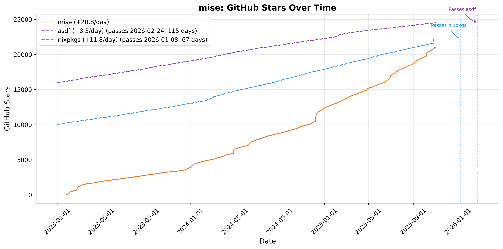
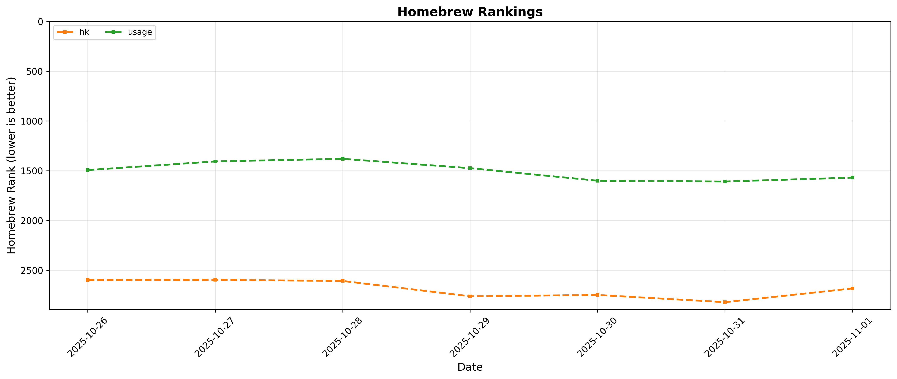

# mise Analytics

## Upcoming Crossovers

<!-- START upcoming-crossovers -->

| Competitor | Expected Crossover | Days Until | mise lead gain (stars/day) |
| --- | --- | --- | --- |
| nixpkgs | 2026-01-05 | 58 | 19.5 |
| asdf | 2026-03-02 | 113 | 29.5 |

<!-- END upcoming-crossovers -->

## mise Stats

## hk Stats

## Top Repos Stats

## Homebrew Rankings

## mise Homebrew Ranking

## Fastest Growing jdx Repos (30 Days)

<!-- START fastest-growing -->

Data window: 2025-10-10 → 2025-11-08 (UTC)

| Date | mise | fnox | usage |
| --- | --- | --- | --- |
| 2025-10-10 | 20,302 (+0) | 0 (+0) | 398 (+0) |
| 2025-10-11 | 20,333 (+31) | 0 (+0) | 399 (+1) |
| 2025-10-12 | 20,363 (+30) | 0 (+0) | 399 (+0) |
| 2025-10-13 | 20,396 (+33) | 0 (+0) | 400 (+1) |
| 2025-10-14 | 20,440 (+44) | 0 (+0) | 401 (+1) |
| 2025-10-15 | 20,475 (+35) | 0 (+0) | 402 (+1) |
| 2025-10-16 | 20,518 (+43) | 0 (+0) | 403 (+1) |
| 2025-10-17 | 20,559 (+41) | 0 (+0) | 406 (+3) |
| 2025-10-18 | 20,580 (+21) | 0 (+0) | 406 (+0) |
| 2025-10-19 | 20,596 (+16) | 0 (+0) | 406 (+0) |
| 2025-10-20 | 20,621 (+25) | 40 (+40) | 407 (+1) |
| 2025-10-21 | 20,652 (+31) | 59 (+19) | 407 (+0) |
| 2025-10-22 | 20,710 (+58) | 82 (+23) | 409 (+2) |
| 2025-10-23 | 20,747 (+37) | 92 (+10) | 409 (+0) |
| 2025-10-24 | 20,772 (+25) | 102 (+10) | 409 (+0) |
| 2025-10-25 | 20,790 (+18) | 108 (+6) | 410 (+1) |
| 2025-10-26 | 20,808 (+18) | 108 (+0) | 411 (+1) |
| 2025-10-27 | 20,819 (+11) | 146 (+38) | 412 (+1) |
| 2025-10-28 | 20,899 (+80) | 359 (+213) | 415 (+3) |
| 2025-10-29 | 20,951 (+52) | 463 (+104) | 416 (+1) |
| 2025-10-30 | 20,984 (+33) | 504 (+41) | 421 (+5) |
| 2025-10-31 | 21,014 (+30) | 540 (+36) | 422 (+1) |
| 2025-11-01 | 21,029 (+15) | 560 (+20) | 423 (+1) |
| 2025-11-02 | 21,050 (+21) | 571 (+11) | 424 (+1) |
| 2025-11-03 | 21,076 (+26) | 577 (+6) | 426 (+2) |
| 2025-11-04 | 21,107 (+31) | 593 (+16) | 428 (+2) |
| 2025-11-05 | 21,155 (+48) | 600 (+7) | 428 (+0) |
| 2025-11-06 | 21,176 (+21) | 605 (+5) | 433 (+5) |
| 2025-11-07 | 21,202 (+26) | 615 (+10) | 434 (+1) |
| 2025-11-08 | 21,221 (+19) | 620 (+5) | 436 (+2) |

- `mise` grew by +919 stars
- `fnox` grew by +620 stars
- `usage` grew by +38 stars

<!-- END fastest-growing -->
